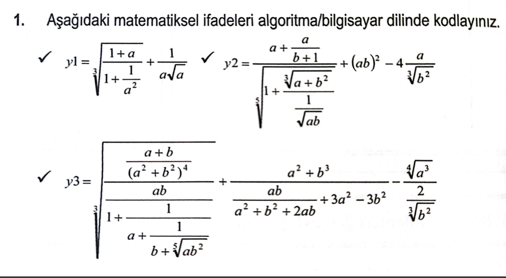

### * Bu dosya içerisine ilk ünite içerisinde yer alan uygulama ve örnekler konulacak.
### * Her örnek için   `Örnek.Numarası_Örnek_İsimli_Dosya`
Şeklinde dosya eklemeleri yapılacak.

## Bölüm Soruları (Python):
### 1:

[1.1.1: Matematiksel İfadeleri Algoritma / Bilgisayar Dilinde Kodlayınız ](./bolum_sonu_sorular/1.1.1_Matematiksel_Ifadeleri_Algoritma_Bilgisayar_Dilinde_Kodlayiniz.py)  
[1.1.2: Matematiksel İfadeleri Algoritma / Bilgisayar Dilinde Kodlayınız ](./bolum_sonu_sorular/1.1.2_Matematiksel_Ifadeleri_Algoritma_Bilgisayar_Dilinde_Kodlayiniz.py)  
[1.1.3: Matematiksel İfadeleri Algoritma / Bilgisayar Dilinde Kodlayınız ](./bolum_sonu_sorular/1.1.3_Matematiksel_Ifadeleri_Algoritma_Bilgisayar_Dilinde_Kodlayiniz.py)
#
[1.2_A_ve_B_Kodlanmış_Aşağıdaki_İfadelerin_sonuçları](./bolum_sonu_sorular/1.2_A_ve_B_Kodlanmış_Aşağıdaki_İfadelerin_sonuçları.py)  
[1.5_İfadelerin_Sonuçlarını_Doğru-1_Yanlış-0_Olarak_Bulunuz](./bolum_sonu_sorular/1.5_İfadelerin_Sonuçlarını_Doğru-1_Yanlış-0_Olarak_Bulunuz.py)  
[1.8: Girilen Sayının 50'den Büyük, Küçük veya Eşitliğini Gösteren Program](./bolum_sonu_sorular/1.8_Girilen_Sayinin_50_den_buyuk_kucuk_veya_esitligini_gosteren_program.py)

[1.9: Öğrenci Geçme Notu Hesaplama Programı](./1.9_Ogrenci_Gecme_Notu_Hesaplama_Programi.py)
[1.13.1_Matematiksel_Ifadeleri_Bilgisayar_Diline_Cevirme_Soru_1](./bolum_sonu_sorular/1.13.1_Matematiksel_Ifadeleri_Bilgisayar_Diline_Cevirme_Soru_1.py)  
[1.13.2_Matematiksel_Ifadeleri_Bilgisayar_Diline_Cevirme_Soru_2](./bolum_sonu_sorular/1.13.2_Matematiksel_Ifadeleri_Bilgisayar_Diline_Cevirme_Soru_2.py)  

## Bölüm Soruları (C#):

[1.8: Girilen Sayının 50'den Büyük, Küçük veya Eşitliğini Gösteren Program](./bolum_sonu_sorular/1.8_Girilen_Sayinin_50_den_buyuk_kucuk_veya_esitligini_gosteren_program.cs)

